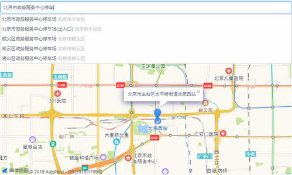

# 高德vue版地图选择器

> UI 框架结合 iview@^3.3.0
> 支持地址检索提示

#### 地图配置

```javascript
// 版本
// "vue-amap": "^0.5.9"

// 引入
import VueAMap from 'vue-amap'

// 注册
Vue.use(VueAMap)

// 配置
VueAMap.initAMapApiLoader({
  key: 'your key',
  plugin: [
    'Geocoder',
    'Autocomplete',
    'MarkerClusterer'
  ],
  // 默认高德 sdk 版本为 1.4.4
  v: '1.4.4'
})
```

#### map-selector 地图选择组件



> 组件使用

```pug
<template>
  <MapSelector :addr="addr" @location-info="locationChange" />
</template>
<script>
import MapSelector from './main'

export default {
  components: { MapSelector },
  data () {
    return {
      addr: {
        lng: '',
        lat: '',
        address: ''
      }
    }
  },
  methods: {
    locationChange ({ address, areaCode, lat, lng }) {
      // 获取地图选择信息
    }
  }
}
</script>
```

> 实现代码

```pug
<template>
  <div class="map-container">
    <div class="ivu-input-wrapper ivu-input-type">
      <input class="ivu-input" ref="searchInput" placeholder="请输入地址" />
    </div>
    <el-amap class="amap-box" ref="map" :center="center" :zoom="zoom" :events="map.events">
      <el-amap-marker :clickable="true" :draggable="true" :raiseOnDrag="true" cursor="move" :offset="[-10, -34]" :position="marker.position" :events="marker.events"></el-amap-marker>
      <el-amap-info-window :visible="infoVisible" :offset="[0, -30]" :content="marker.address" :position="marker.position" :events="info.events"></el-amap-info-window>
    </el-amap>
  </div>
</template>
<script>
const dftLng = '116.403951'
const dftLat = '39.913444'
const dftAddr = '点击地图选择坐标'
export default {
  name: 'mapSelector',
  props: { addr: Object },
  data () {
    return {
      zoom: 13,
      center: [this.addr.lng || dftLng, this.addr.lat || dftLat],
      geocoder: null,
      autocomplete: null,
      placeSearch: null,
      keyword: '',
      infoVisible: true,
      marker: {
        position: [this.addr.lng || dftLng, this.addr.lat || dftLat],
        address: this.addr.address || dftAddr,
        events: {
          click: e => { this.infoVisible = true },
          dragend: e => { this.codeToAdd([e.lnglat.lng, e.lnglat.lat], true) }
        }
      }
    }
  },
  computed: {
    map () {
      return {
        events: {
          click: e => { this.codeToAdd([e.lnglat.lng, e.lnglat.lat]) }
        }
      }
    },
    info () {
      let _this = this
      return {
        events: {
          close () { _this.infoVisible = false }
        }
      }
    }
  },
  mounted () {
    this.$nextTick(() => {
      setTimeout(() => {
        this.geocoder = new window.AMap.Geocoder({
          radius: 1000,
          extensions: 'all'
        })
        this.autocomplete = new window.AMap.Autocomplete({
          input: this.$refs.searchInput
        })
        window.AMap.event.addListener(this.autocomplete, 'select', e => {
          this.codeToAdd([e.poi.location.lng, e.poi.location.lat])
        })
      }, 100)
    })
  },
  watch: {
    addr: {
      handler (val) {
        setTimeout(() => {
          if (val && !val.areaCode && val.lng && val.lat) {
            this.codeToAdd([val.lng, val.lat])
          }
        }, 100)
      },
      deep: true
    }
  },
  methods: {
    codeToAdd (lnglat, isOffset) {
      this.geocoder && this.geocoder.getAddress(lnglat, (status, result) => {
        if (status === 'complete' && result.info === 'OK') {
          const rr = result.regeocode
          const add = rr.formattedAddress
          this.marker.position = [lnglat[0], lnglat[1]]
          this.marker.address = add
          this.$emit('location-info', {
            address: add,
            areaCode: rr.addressComponent.adcode,
            lat: lnglat[1],
            lng: lnglat[0]
          })
        }
      })
    }
  }
}
</script>
<style lang="less" scoped>
.map-container {
  width: 770px !important;
  height: 460px;
  padding-top: 40px;
  position: relative;
  .ivu-input-wrapper.ivu-input-type {
    position: absolute;
    top: 0
  }
}
.amap-box {
  width: 100%;
  height: 100%
}
</style>
```

#### map-selector-modal 地图选择组件弹出框


> 组件使用

```pug
<template>
  <MapModal v-model="mapModal" :addr="addr" @location-confirm="locationSelect" />
</template>
<script>
import { MapModal } from '@components/map-selector'

export default {
  components: { MapModal },
  data () {
    return {
      mapModal: false,
      addr: {
        lng: '',
        lat: '',
        address: ''
      }
    }
  },
  methods: {
    locationChange ({ address, areaCode, lat, lng }) {
      // 获取地图选择信息
    }
  }
}
</script>
```

> 代码实现，基于上述组件 map-selector

```pug
<template>
  <Modal v-model="mapModal" footer-hide title="选择地址" width="802" :z-index="100">
    <MapSelector :addr="addr" @location-info="locationChange" />
    <div class="custom-modal-footer">
      <Button type="primary" @click="confirm">确定</Button>
    </div>
  </Modal>
</template>
<script>
import MapSelector from './main'

export default {
  name: 'mapModal',
  components: { MapSelector },
  props: {
    value: Boolean,
    addr: Object
  },
  data () {
    return {
      mapModal: this.value,
      location: this.addr
    }
  },
  watch: {
    value (val) {
      this.mapModal = val
    },
    mapModal (val) {
      this.$emit('input', val)
    }
  },
  methods: {
    locationChange (val) {
      this.location = val
    },
    confirm () {
      this.$emit('location-confirm', this.location)
    }
  }
}
</script>
```